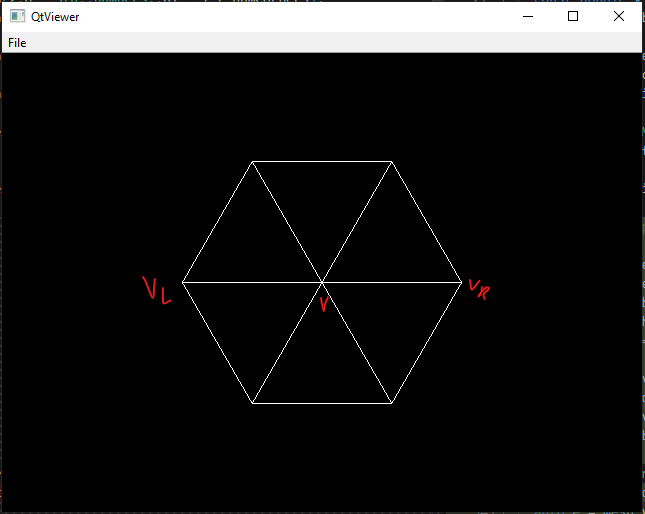
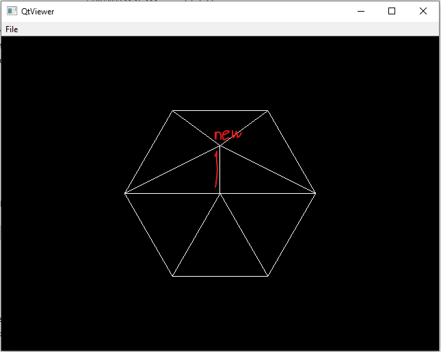

# Geometry Processing

Using OpenMesh

```cmd
cl /std:c++20 /W4 /external:I"../dependencies" /external:W0 /I"../dependencies/OpenMesh/src" ../dependencies/OpenMesh/build/Build/lib/OpenMeshCore.lib /MD /D_USE_MATH_DEFINES /EHsc cube.cpp
```

or

```cmd
cl /std:c++20 /W4 /external:I"../dependencies" /external:W0 ^
  /I"../dependencies/OpenMesh/src" ../dependencies/OpenMesh/build/Build/lib/OpenMeshCore.lib /MD ^
  /D_USE_MATH_DEFINES ^
  /EHsc cube.cpp
```

## `vertex_split` study

Observed that `vl` and `vr` needs to be neighbors of `v`, the vertex that is being splited.

Before split



After split



## Viz

Use OpenMesh to generate the mesh, and RayLib to visualize it.

```cmd
cl /std:c++20 /W4 /external:I"../dependencies" /external:W0 /I"../dependencies/OpenMesh/src" ../dependencies/OpenMesh/build/Build/lib/OpenMeshCore.lib /D_USE_MATH_DEFINES /I"../dependencies/raylib/build/raylib/include" ../dependencies/raylib/build/raylib/Release/raylib.lib User32.lib gdi32.lib Shell32.lib Winmm.lib /MD /EHsc omeshgenviz.cpp
```

Just raylib with debug symbols

```cmd
cl /std:c++20 /W4 /external:I"../dependencies" /external:W0 /I"../dependencies/raylib/build/raylib/include" ../dependencies/raylib/build/raylib/Release/raylib.lib User32.lib gdi32.lib Shell32.lib Winmm.lib /MD /EHsc dynmesh.cpp /Zi
```
